# SciFlow Bounty Lifecycle State Machine

## Mermaid.js Diagram

```mermaid
stateDiagram-v2
    [*] --> Drafting: Create Bounty

    %% ========================================
    %% PHASE 1: CREATION & FUNDING
    %% ========================================
    
    state "📝 Drafting" as Drafting {
        [*] --> DefineProtocol
        DefineProtocol --> SetMilestones
        SetMilestones --> SetBudget
        SetBudget --> [*]
    }
    
    Drafting --> ProtocolReview: Submit Draft
    Drafting --> Cancelled: Cancel

    state "✅ Protocol Review" as ProtocolReview
    ProtocolReview --> ReadyForFunding: Valid
    ProtocolReview --> Drafting: Invalid

    state "💳 Ready for Funding" as ReadyForFunding
    ReadyForFunding --> FundingEscrow: Initiate Funding
    ReadyForFunding --> Cancelled: Cancel

    %% ========================================
    %% PHASE 2: ESCROW (CRITICAL)
    %% ========================================
    
    state "🔒 Funding Escrow" as FundingEscrow {
        [*] --> Processing
        
        state "⏳ Processing" as Processing
        state "✅ Locked" as Locked
        state "❌ Failed" as Failed
        
        Processing --> Locked: Funds Confirmed
        Processing --> Failed: Payment Failed
        Failed --> Processing: Retry Payment
        Locked --> [*]
    }

    FundingEscrow --> Bidding: Escrow Secured

    %% ========================================
    %% PHASE 3: BIDDING
    %% ========================================
    
    state "🔬 Bidding" as Bidding {
        [*] --> OpenBids
        
        state "📢 Open for Bids" as OpenBids
        state "✅ Lab Selected" as LabSelected
        state "❌ No Valid Bids" as NoValidBids
        
        OpenBids --> OpenBids: Receive Proposal
        OpenBids --> LabSelected: Select Lab
        OpenBids --> NoValidBids: Reject All
        NoValidBids --> OpenBids: Reopen
        LabSelected --> [*]
    }
    
    Bidding --> ActiveResearch: Start Research
    Bidding --> Refunding: Cancel (Refund Escrow)

    %% ========================================
    %% PHASE 4: ACTIVE RESEARCH
    %% ========================================
    
    state "⚗️ Active Research" as ActiveResearch
    note right of ActiveResearch
        Lab conducts research
        Following defined protocol
        Collecting evidence for milestones
    end note

    ActiveResearch --> MilestoneReview: Submit Milestone
    ActiveResearch --> DisputeResolution: Initiate Dispute

    %% ========================================
    %% PHASE 5: MILESTONE REVIEW
    %% ========================================
    
    state "📋 Milestone Review" as MilestoneReview
    note right of MilestoneReview
        Funder verifies:
        • Data integrity (hash check)
        • Protocol compliance
        • Quality standards
    end note

    MilestoneReview --> ActiveResearch: Request Revision
    MilestoneReview --> ActiveResearch: Approve (More Milestones)
    MilestoneReview --> CompletedPayout: Approve (Final Milestone)
    MilestoneReview --> DisputeResolution: Initiate Dispute

    %% ========================================
    %% PHASE 6: DISPUTE RESOLUTION
    %% ========================================
    
    state "⚠️ Dispute Resolution" as DisputeResolution {
        [*] --> Investigation
        
        state "🔍 Investigation" as Investigation
        state "⚖️ Arbitration Decision" as ArbitrationDecision
        
        Investigation --> ArbitrationDecision: Evidence Reviewed
    }
    
    note left of DisputeResolution
        SLASHER MECHANISM:
        If fraud confirmed, lab's
        staked tokens are slashed
        and transferred to funder
    end note

    DisputeResolution --> CompletedPayout: Lab Wins
    DisputeResolution --> Refunding: Funder Wins
    DisputeResolution --> PartialSettlement: Split Decision
    DisputeResolution --> ExternalArbitration: Escalate

    state "⚖️ External Arbitration" as ExternalArbitration
    ExternalArbitration --> CompletedPayout: Lab Wins
    ExternalArbitration --> Refunding: Funder Wins
    ExternalArbitration --> PartialSettlement: Split Decision

    %% ========================================
    %% PHASE 7: TERMINAL STATES
    %% ========================================
    
    state "💰 Completed Payout" as CompletedPayout
    note right of CompletedPayout
        Release funds from escrow:
        • Stripe: Release hold
        • Solana: Execute PDA transfer
        • Base: Call release() on contract
    end note

    CompletedPayout --> Completed: Final Payout Released

    state "✅ Completed" as Completed
    state "🔄 Partial Settlement" as PartialSettlement
    state "↩️ Refunding" as Refunding
    state "❌ Cancelled" as Cancelled

    Refunding --> Cancelled: Refund Complete
    
    Completed --> [*]
    PartialSettlement --> [*]
    Cancelled --> [*]
```



## State Transition Matrix

| From State | Event | To State | Guard Conditions |
|------------|-------|----------|------------------|
| Drafting | SUBMIT_DRAFT | Protocol Review | Protocol defined |
| Drafting | CANCEL_BOUNTY | Cancelled | - |
| Protocol Review | (auto) | Ready for Funding | Valid protocol |
| Protocol Review | (auto) | Drafting | Invalid protocol |
| Ready for Funding | INITIATE_FUNDING | Funding Escrow | Payment method selected |
| Funding Escrow | FUNDING_CONFIRMED | Bidding | Funds locked |
| Funding Escrow | FUNDING_FAILED | Funding Escrow (Failed) | - |
| Bidding | SUBMIT_PROPOSAL | Bidding | Lab is verified |
| Bidding | SELECT_LAB | Active Research | Has proposals |
| Bidding | CANCEL_BOUNTY | Refunding | - |
| Active Research | SUBMIT_MILESTONE | Milestone Review | Evidence provided |
| Active Research | INITIATE_DISPUTE | Dispute Resolution | - |
| Milestone Review | APPROVE_MILESTONE | Active Research | More milestones |
| Milestone Review | APPROVE_MILESTONE | Completed Payout | Last milestone |
| Milestone Review | REQUEST_REVISION | Active Research | - |
| Milestone Review | INITIATE_DISPUTE | Dispute Resolution | - |
| Dispute Resolution | RESOLVE_DISPUTE (lab_wins) | Completed Payout | - |
| Dispute Resolution | RESOLVE_DISPUTE (funder_wins) | Refunding | Slash stake |
| Dispute Resolution | RESOLVE_DISPUTE (partial) | Partial Settlement | - |
| Completed Payout | RELEASE_FINAL_PAYOUT | Completed | - |

## Payment Flow by Escrow Type

### Stripe (Fiat)
```
1. INITIATE_FUNDING → Create PaymentIntent with capture_method=manual
2. FUNDING_CONFIRMED → Authorize (not capture) the payment
3. APPROVE_MILESTONE → Capture partial amount for milestone
4. RELEASE_FINAL_PAYOUT → Capture remaining amount
5. REFUNDING → Cancel PaymentIntent (auto-refund)
```

### Solana (USDC)
```
1. INITIATE_FUNDING → Generate escrow PDA address
2. FUNDING_CONFIRMED → Transfer USDC to escrow PDA (funder signs)
3. APPROVE_MILESTONE → Execute release instruction (milestone %)
4. RELEASE_FINAL_PAYOUT → Execute final_release instruction
5. REFUNDING → Execute refund instruction (returns to funder)
```

### Base L2 (USDC)
```
1. INITIATE_FUNDING → Deploy/call escrow contract
2. FUNDING_CONFIRMED → deposit() call with USDC approval
3. APPROVE_MILESTONE → releaseMilestone(milestoneId) call
4. RELEASE_FINAL_PAYOUT → releaseAll() call
5. REFUNDING → refund() call (requires dispute resolution)
```

## Dispute Slashing Mechanism

When a dispute resolves in favor of the funder:

1. **Calculate Slash Amount**: Based on severity and stage
   - Protocol deviation: 25% of stake
   - Data falsification: 100% of stake
   - Sample tampering: 100% of stake + legal escalation
   - Timeline breach: 10-50% based on delay

2. **Execute Slash**:
   - Transfer slashed tokens from Lab's staking pool
   - Credit to Funder's account or protocol treasury

3. **Update Lab Verification Tier**:
   - Major violations: Downgrade to 'unverified'
   - Minor violations: Warning, potential downgrade after 3 strikes

## Key Safety Properties

1. **No Fund Leakage**: Funds can only exit via:
   - Milestone approval (to lab)
   - Dispute resolution (to winner)
   - Cancellation (refund to funder)

2. **Immutable State Flow**: Cannot skip states (e.g., cannot go from Drafting to Active Research)

3. **Evidence Requirements**: Milestone approval requires on-chain evidence hash

4. **Stake At Risk**: Labs must stake tokens to bid, creating economic accountability
